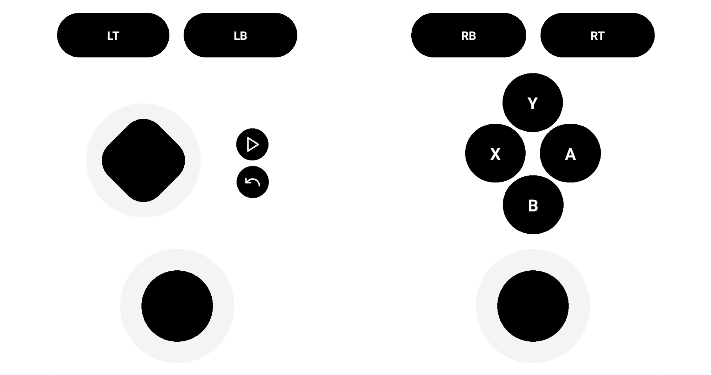

# Game Pad



### 1. Description

This project demonstrates how to create a virtual controller as a mobile app using Expo that connects to a local server built with Node.js and Socket.IO. The server emulates a gamepad using the ViGEm library, allowing you to control the gamepad buttons, axes, triggers, and D-pad from your mobile device.

### 2. Prerequisites

- Visual Studio with C++ development tools installed: https://visualstudio.microsoft.com/downloads/
- ViGEm library: https://github.com/nefarius/ViGEmBus
- Node.js and npm (or yarn): https://nodejs.org/en

### 3. Installation

###### Clone the repository:

```bash
git clone https://github.com/yaserrar/game-pad
```

###### Install dependencies (server-side):

```bash
cd game-pad-server
npm install
```

###### Install dependencies (mobile-side):

```bash
cd game-pad-mobile
npm install
```

###### Set up server host:

find your ip adresse and add it in to the env variable EXPO_PUBLIC_SERVER_URL in .env file of game-pad-mobile

### 4. Running

###### Run server:

```bash
cd game-pad-server
npm run start
```

###### Run mobile app:

```bash
cd game-pad-mobile
npm run start
```

and use your phone with expo go installed and scan the QR code.
